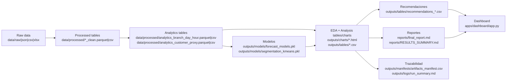
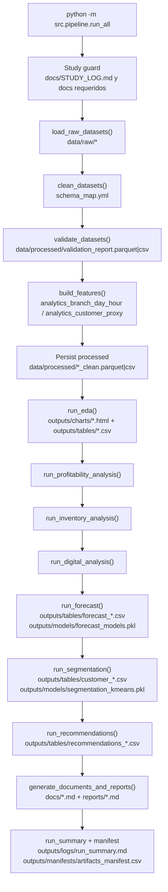

# STUDY_FLOW_BIGDATA_MINING

Apuntes de estudio para entender el flujo de control del proyecto **Sabor Mexicano** y la relación entre **Big Data**, **Ingeniería de Datos**, **Minería de Datos** y **BI**.

## 1) Conceptos base

### 1.1 ¿Qué es Big Data?
Big Data no significa solo “muchos datos”. Es un contexto donde los datos presentan varias características simultáneas (las 5V):

1. **Volumen**: cantidad alta de registros.
Ejemplo: millones de tickets de venta históricos por sucursal.
2. **Velocidad**: datos que llegan rápido o casi en tiempo real.
Ejemplo: reseñas y menciones digitales cada hora.
3. **Variedad**: diferentes formatos y estructuras.
Ejemplo: JSON, CSV y XLSX en `data/raw/`.
4. **Veracidad**: calidad y confiabilidad variable.
Ejemplo: columnas con nombres inconsistentes y valores faltantes.
5. **Valor**: utilidad de negocio que se puede extraer.
Ejemplo: pronosticar insumos y reducir merma para mejorar margen.

Idea clave: Big Data es el **escenario de complejidad y escala**, no una herramienta específica.

### 1.2 ¿Qué es Minería de Datos?
Es el proceso de descubrir patrones útiles en datos para responder preguntas como:
- ¿Qué clientes son parecidos?
- ¿Qué factores explican baja rentabilidad?
- ¿Qué ingredientes tendrán pico de demanda?

En este repo, minería de datos aparece en:
- **Segmentación** (`src/models/segmentation.py`): RFM proxy + KMeans.
- **Pronóstico** (`src/models/forecast.py`): series mensuales por sucursal/ingrediente.
- **Recomendaciones** (`src/reco/recommendations.py`): reglas accionables basadas en señales de negocio.

### 1.3 ¿Qué es Analítica/BI?
BI (Business Intelligence) es la capa de **comunicación para decisión**:
- KPI (ticket promedio, margen proxy, merma).
- reportes ejecutivos (`reports/final_report.md`, `reports/RESULTS_SUMMARY.md`).
- dashboard (`apps/dashboard/app.py`).

Diferencia práctica:
- **Minería de Datos**: descubre patrones/modelos (segmentos, pronósticos).
- **BI**: presenta resultados para decidir (tablas, gráficos, KPIs, storytelling).

### 1.4 ¿Qué es un Pipeline y por qué importa?
Un pipeline es una secuencia de etapas con entradas/salidas definidas y ordenadas.

Importa porque permite:
- **Reproducibilidad**: mismo comando, mismo flujo.
- **Automatización**: correr de punta a punta con `python -m src.pipeline.run_all ...`.
- **Escalabilidad**: cambiar componentes sin romper todo el sistema.
- **Trazabilidad**: saber qué artefacto se generó y cuándo (`outputs/manifests/artifacts_manifest.csv`).

### 1.5 ETL vs ELT (aplicado a este repo)
- **ETL**: Extraer -> Transformar -> Cargar.
  Se transforma antes de cargar el destino analítico final.
- **ELT**: Extraer -> Cargar -> Transformar.
  Se carga primero (raw/lake) y se transforma luego según análisis.

En Sabor Mexicano hay una estrategia híbrida orientada a ELT local:
1. Se **extrae** de `data/raw/json|csv|xlsx`.
2. Se **carga** en tablas crudas en memoria (y luego procesadas en `data/processed`).
3. Se **transforma** en limpieza/feature engineering/análisis/modelado.

Ejemplo concreto:
- Raw JSON de ventas -> `clean_datasets()` -> `analytics_branch_day_hour` -> forecast/recomendaciones.

## 2) Conexión: Big Data -> Data Engineering -> Data Mining -> BI

### Analogía simple (restaurante)
- **Big Data**: llegan cajas de ingredientes de muchos proveedores, a distinta hora y con etiquetas distintas.
- **Data Engineering**: ordenar almacén, etiquetar igual, validar caducidad y preparar mise en place.
- **Data Mining**: descubrir qué platillos se venden juntos, qué cliente vuelve, qué insumo subirá en demanda.
- **BI**: presentar al director qué comprar, qué promocionar y en qué sucursal actuar primero.

### Ejemplo continuo en este repo
`ventas crudas -> limpieza -> tabla analytics -> segmentación -> recomendación -> dashboard`

1. Ventas crudas (`data/raw/...`) entran con columnas heterogéneas.
2. Limpieza y mapeo de esquema unifican nombres/tipos.
3. Se crea tabla analítica `analytics_branch_day_hour`.
4. Se segmentan clientes (RFM proxy + clustering).
5. Se generan recomendaciones por sucursal/segmento/platillo/insumo.
6. Todo se comunica en dashboard y reportes para decisión ejecutiva.

## 3) Control de flujo exacto (`src/pipeline/run_all.py`)

Orden real de ejecución (simplificado):

1. `ensure_study_docs_exist()` y `ensure_study_log_updated_for_run(...)`
2. `load_settings()` + `load_schema_map()` + `load_recipe_map()`
3. `ensure_directories()` + seed + logger + tracker
4. **Fase 1**:
   - `load_raw_datasets()`
   - `profile_raw_tables()`
   - `clean_datasets()`
   - `validate_datasets()`
   - `build_features()`
   - persistencia en `data/processed/`
   - `run_eda()`
5. **Fase 2**:
   - `run_profitability_analysis()`
   - `run_inventory_analysis()`
   - `run_digital_analysis()`
6. **Fase 3**:
   - `run_forecast()`
   - `run_segmentation()`
7. **Fase 4**:
   - `run_recommendations()`
   - `generate_documents_and_reports()`
8. `render_run_summary_markdown()` + `write_run_summary()`
9. append de resumen a `docs/STUDY_LOG.md`
10. `tracker.save_manifest(outputs/manifests/artifacts_manifest.csv)`

### Etapa por etapa: entradas, transformación, salidas, validación

#### Etapa A: Ingesta (`src/data/load.py`)
- **Inputs**:
  - `data/raw/json/*.json`
  - `data/raw/csv/*.csv`
  - `data/raw/xlsx/*.xlsx`
- **Transformación**:
  - Detecta dataset por nombre.
  - Prioriza fuente `json > csv > xlsx`.
  - Deduplica workbooks XLSX por firma de contenido.
- **Outputs**:
  - `raw_tables` en memoria (`sales`, `customers`, `branches`, `inventory`, `digital`).
  - `source_report` para trazabilidad.
- **Por qué existe**:
  - Evitar dependencia rígida de un solo formato.
- **Cómo validar**:
  - Revisar logs: “Dataset cargado: ... fuente=... filas=...”.
  - Revisar `docs/DATA_PROFILE.md`.
- **Qué puede salir mal**:
  - Archivos mal nombrados o hoja XLSX distinta.
  - JSON con estructura no lista.

#### Etapa B: Limpieza y estandarización (`src/data/clean.py`)
- **Inputs**:
  - `raw_tables` + `config/schema_map.yml`.
- **Transformación**:
  - Mapea aliases a nombres canónicos.
  - Normaliza tipos (numérico, fecha, booleano, string).
  - Deriva campos (`year_month`, `daypart`, `gross_margin`).
  - Maneja nulos y elimina duplicados.
- **Outputs**:
  - `clean_tables` en memoria.
  - Persistencia: `data/processed/*_clean.parquet` (o `.csv` fallback).
- **Por qué existe**:
  - Sin datos limpios, modelos y KPI son inestables.
- **Cómo validar**:
  - Revisar columnas canónicas en `docs/DATA_DICTIONARY.md`.
  - Verificar que no haya errores de tipos en parquet.
- **Qué puede salir mal**:
  - Mezcla de tipos (ej. `postal_code`).
  - Fechas inválidas o montos con símbolos no limpiados.

#### Etapa C: Validación (`src/data/validate.py`)
- **Inputs**:
  - `clean_tables` + columnas requeridas de `schema_map`.
- **Transformación**:
  - Evalúa columnas faltantes, duplicados y nulos críticos.
- **Outputs**:
  - `validation_report` en memoria.
  - Persistencia: `data/processed/validation_report.parquet` (o csv).
- **Por qué existe**:
  - Detecta calidad mínima antes de análisis/modelado.
- **Cómo validar**:
  - Abrir `data/processed/validation_report.parquet|csv`.
- **Qué puede salir mal**:
  - Falta columna clave y el pipeline avanza con warning (riesgo analítico).

#### Etapa D: Features (`src/features/build_features.py`)
- **Inputs**:
  - `sales`, `branches`, `digital`, `customers` limpios.
- **Transformación**:
  - Crea tabla agregada `analytics_branch_day_hour`.
  - Crea tabla cliente `analytics_customer_proxy` para RFM proxy.
  - Opción `POLARS=1` para acelerar agregaciones.
- **Outputs**:
  - `data/processed/analytics_branch_day_hour.parquet|csv`
  - `data/processed/analytics_customer_proxy.parquet|csv`
- **Por qué existe**:
  - Convertir datos transaccionales en estructura modelable.
- **Cómo validar**:
  - Verificar granularidad branch-date-hour.
  - Revisar columnas `recency_days`, `frequency`, `monetary`.
- **Qué puede salir mal**:
  - Ausencia de `date` en ventas afecta recencia y agregaciones temporales.

#### Etapa E: EDA (`src/eda/eda.py`)
- **Inputs**:
  - Tablas limpias + features.
- **Transformación**:
  - Calcula tendencias, mixes y rankings descriptivos.
- **Outputs** (ejemplos clave):
  - `outputs/charts/sales_trend_daily.html`
  - `outputs/charts/sales_trend_monthly.html`
  - `outputs/charts/branch_ranking_sales_margin.html`
  - `outputs/charts/digital_sentiment_platform.html`
  - `outputs/tables/sales_by_city.csv`
  - `outputs/tables/top_dishes_by_region_daypart.csv`
- **Por qué existe**:
  - Entender comportamiento antes de modelar.
- **Cómo validar**:
  - Abrir gráficos HTML y confirmar coherencia de ejes/unidades.
- **Qué puede salir mal**:
  - Dataset vacío en un módulo deja gráfico faltante o incompleto.

#### Etapa F: Análisis de negocio (`src/analysis/*`)

1. `profitability.py`
- **Outputs**:
  - `outputs/tables/profitability_branch_ranking.csv`
  - `outputs/tables/profitability_dish_ranking.csv`
  - `outputs/tables/profitability_drivers.csv`

2. `inventory.py`
- **Outputs**:
  - `outputs/tables/inventory_waste_drivers.csv`
  - `outputs/tables/inventory_shortage_summary.csv`
  - `outputs/tables/inventory_reorder_policy.csv`
  - `outputs/tables/inventory_branch_kpis.csv`

3. `digital.py`
- **Outputs**:
  - `outputs/tables/digital_branch_summary.csv`
  - `outputs/tables/digital_campaign_summary.csv`
  - `outputs/tables/digital_platform_sentiment.csv`

- **Por qué existe**:
  - Traducir datos a hipótesis accionables de rentabilidad, inventario y marketing.
- **Cómo validar**:
  - Revisar que sucursales top/bottom existan y tengan métricas numéricas.
- **Qué puede salir mal**:
  - Costos proxy mal imputados sesgan ranking de margen.

#### Etapa G: Modelos (`src/models/*`)

1. `forecast.py`
- **Outputs**:
  - `outputs/tables/forecast_monthly_demand.csv`
  - `outputs/tables/forecast_peak_months.csv`
  - `outputs/models/forecast_models.pkl`

2. `segmentation.py`
- **Outputs**:
  - `outputs/tables/customer_segments.csv`
  - `outputs/tables/customer_personas_summary.csv`
  - `outputs/models/segmentation_kmeans.pkl`

- **Por qué existe**:
  - Predecir demanda y descubrir perfiles de clientes.
- **Cómo validar**:
  - Pronósticos no negativos y con horizonte correcto.
  - Segmentos reproducibles con seed fija.
- **Qué puede salir mal**:
  - Muy pocos puntos históricos por ingrediente/sucursal.
  - Variables de cliente insuficientes para separación útil de clusters.

#### Etapa H: Recomendaciones (`src/reco/recommendations.py`)
- **Inputs**:
  - Salidas de análisis + modelos + tablas limpias/features.
- **Transformación**:
  - Combina score de volumen/margen/señal digital.
  - Sugiere campañas por persona/sucursal.
  - Propone acciones de reorden/inventario.
- **Outputs**:
  - `outputs/tables/recommendations_dish_promotions.csv`
  - `outputs/tables/recommendations_branch_campaigns.csv`
  - `outputs/tables/recommendations_inventory_actions.csv`
- **Por qué existe**:
  - Convertir insight en plan operativo ejecutable.
- **Cómo validar**:
  - Confirmar que no esté vacío y que incluya campos clave de acción.
- **Qué puede salir mal**:
  - Si faltan entradas aguas arriba, produce menos recomendaciones.

#### Etapa I: Reportería y documentación (`src/report/generate_report.py`)
- **Outputs**:
  - `docs/DATA_PROFILE.md`
  - `docs/DATA_DICTIONARY.md`
  - `docs/METHODOLOGY.md`
  - `docs/ASSUMPTIONS.md`
  - `reports/final_report.md`
  - `reports/RESULTS_SUMMARY.md`
- **Por qué existe**:
  - Entregar hallazgos con narrativa para clase y dirección.
- **Cómo validar**:
  - Verificar que nombres de archivos de salida estén referenciados en reporte.
- **Qué puede salir mal**:
  - Cambios en nombres de artefactos sin actualizar reporte.

#### Etapa J: Trazabilidad final (Study + Manifest)
- **Outputs**:
  - `outputs/logs/run_summary.md`
  - append automático en `docs/STUDY_LOG.md`
  - `outputs/manifests/artifacts_manifest.csv`
- **Por qué existe**:
  - Auditabilidad del run y control de cambios.
- **Cómo validar**:
  - Confirmar contador de artefactos y tiempos por fase.

## 4) Diagramas de flujo

### Diagrama 1: Flujo de datos de alto nivel

### Diagrama 2: Flujo de control / orquestación (`run_all.py`)

## 5) “Big Data style” en ESTE repositorio (sin sobreafirmar)

Este proyecto corre local, pero adopta patrones de ingeniería escalables:

1. **Capa de mapeo de esquema**:
   - `config/schema_map.yml`.
   - Permite absorber columnas heterogéneas sin romper el flujo.
2. **Pipeline reproducible**:
   - único entrypoint: `src/pipeline/run_all.py`.
   - argumentos de semilla y horizonte para reproducibilidad.
3. **Parquet preferente + fallback CSV**:
   - `src/utils/io.py` intenta parquet y cae a csv con warning.
4. **Tablas agregadas “partition-friendly”**:
   - `analytics_branch_day_hour` y `year_month` ayudan a escalar consultas.
5. **Separación de responsabilidades**:
   - `data`, `features`, `eda`, `analysis`, `models`, `reco`, `report`, `apps`.

### Cómo escalar después
1. Activar `POLARS=1` para lectura/agregación más rápida.
2. Particionar outputs por `year_month/branch_id`.
3. Implementar cargas incrementales (solo nuevos días).
4. Migrar orquestación local a jobs programados.
5. Escalar a Spark cuando volumen/latencia lo justifiquen.

### Sobre trazabilidad por manifest
`outputs/manifests/artifacts_manifest.csv` registra:
- timestamp,
- ruta de artefacto,
- tipo (`table`, `chart`, `model`, `document`),
- módulo que lo produjo.

Por qué importa:
- auditoría de “qué se generó en cada corrida”,
- depuración más rápida,
- base para control de calidad por artefacto.

## 6) Mini guía de estudio (plan sugerido)

Secuencia recomendada:

1. Leer `README.md` para contexto operativo.
2. Leer `src/pipeline/run_all.py` para entender orquestación.
3. Revisar este documento (`STUDY_FLOW_BIGDATA_MINING.md`).
4. Abrir `docs/DATA_PROFILE.md` y `docs/DATA_DICTIONARY.md`.
5. Ejecutar pipeline y leer `outputs/logs/run_summary.md`.
6. Revisar `outputs/tables/` (analíticos, modelos, recomendaciones).
7. Abrir dashboard (`apps/dashboard/app.py`) y pestaña de estudio.
8. Leer `reports/final_report.md` y comprobar coherencia con tablas.

### Flashcards (10)

1. **¿Big Data es solo volumen?**
No. Incluye volumen, velocidad, variedad, veracidad y valor.

2. **¿Qué aporta Data Engineering antes de modelar?**
Estandariza calidad y estructura para que minería y BI sean confiables.

3. **¿Qué diferencia hay entre Minería de Datos y BI?**
Minería descubre patrones/modelos; BI comunica resultados y decisiones.

4. **¿Por qué este proyecto usa pipeline modular?**
Para reproducibilidad, mantenimiento y escalado por etapas.

5. **¿Por qué RFM aquí es “proxy”?**
Porque no hay llave directa cliente-ticket en ventas.

6. **¿Qué pasa si falta `pyarrow`?**
La escritura cae a CSV como fallback sin romper el pipeline.

7. **¿Para qué sirve `schema_map.yml`?**
Mapea aliases de columnas a nombres canónicos.

8. **¿Qué tabla resume operación por sucursal y hora?**
`analytics_branch_day_hour`.

9. **¿Qué archivo permite auditar artefactos generados?**
`outputs/manifests/artifacts_manifest.csv`.

10. **¿Qué valida rápidamente que el pipeline corrió bien?**
`outputs/logs/run_summary.md` + presencia de tablas/charts esperados.

## Qué preguntaría un profesor

1. “Explícame la diferencia entre ETL y ELT en tu implementación.”
2. “¿Cuál es el orden exacto de `run_all.py` y por qué ese orden?”
3. “Dame un ejemplo de riesgo de calidad de datos y cómo lo mitigaste.”
4. “¿Por qué dices que es Big Data style si no usas Spark?”
5. “¿Cómo verificas que tus recomendaciones no son humo?”
6. “¿Qué evidencia de trazabilidad tienes por corrida?”

## Cómo responderlo (guía breve)

1. “Usamos un flujo tipo ELT local: cargamos raw heterogéneo y transformamos por fases reproducibles.”
2. “El orden es: ingestión -> limpieza -> validación -> features -> EDA -> análisis -> modelos -> recomendaciones -> reportes -> resumen/manifest.”
3. “Ejemplo: tipos mixtos en `postal_code`; se tipó explícitamente a string para escritura robusta en parquet.”
4. “No afirmamos cómputo distribuido; aplicamos patrones escalables: schema mapping, pipeline desacoplado, formato columnar y agregaciones partition-friendly.”
5. “Las recomendaciones salen de métricas verificables: volumen, margen proxy, digital, inventario y pronóstico; además se exportan como tablas auditables.”
6. “Cada run deja `run_summary.md` y `artifacts_manifest.csv`, con rutas y tiempos por etapa.”
